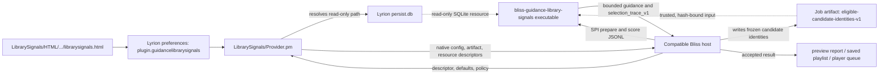
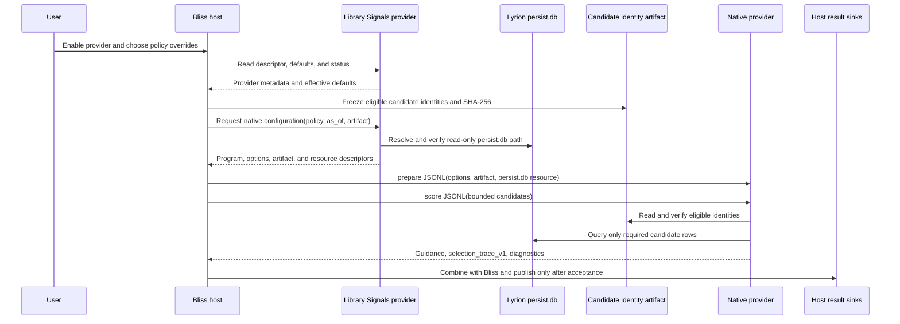

# Bliss Guidance: Library Signals

`lms-guidance-library-signals` is a passive Lyrion guidance provider plugin in
the **Bliss Guidance** family. It contributes optional play-count, last-played,
and library-age guidance when a compatible Bliss host invokes it. It does not
select music, reorder tracks, or control playback by itself; another plugin
must discover, enable, and use it.

## How it works

[Better Call Bliss](https://github.com/chrober/lms-better-call-bliss) and
[Bliss Mixer Lab](https://github.com/chrober/lms-blissmixer-lab) discover this
provider through Lyrion's plugin manager. Each host keeps it disabled by
default and can expose host-specific overrides. Provider settings on this page
remain the defaults when a host has no override.

The provider invokes the native
[`bliss-guidance-library-signals`](https://github.com/chrober/lms-guidance-library-signals)
binary. It reads Lyrion's `persist.db` read-only, uses a frozen candidate
identity artifact supplied by the host, and returns bounded guidance through
the host-neutral
[`bliss-playlist-guidance-spi`](https://github.com/chrober/bliss-playlist-guidance-spi).

Provider conventions and UI rules are documented in
[`lms-bliss-guidance-provider-kit`](https://github.com/chrober/lms-bliss-guidance-provider-kit).

## Architecture

The provider-owned files, resources, and streams are:

- `LibrarySignals/Plugin.pm` exposes the discoverable provider, while
  `LibrarySignals/Settings.pm` registers its settings page.
- `LibrarySignals/HTML/EN/plugins/LibrarySignals/settings/librarysignals.html`
  renders that page; persisted values live in the Lyrion
  `plugin.guidancelibrarysignals` preference namespace.
- `LibrarySignals/Provider.pm` publishes the descriptor and defaults, resolves
  host/job overrides, locates `persist.db` through Lyrion's SQLite helper, and
  returns the native program, effective horizons, trusted artifact descriptor,
  and read-only resource descriptor to the host.
- The host creates the frozen `eligible-candidate-identities-v1` JSON artifact
  and supplies its path and SHA-256. The native provider reads only that
  bounded identity artifact and the read-only `persist.db` resource; it does
  not scan or rewrite the whole LMS library.
- `bliss-guidance-library-signals` receives options, the artifact descriptor,
  and resource descriptor through SPI JSONL on stdin. It returns bounded
  play-count, last-played, and library-age guidance,
  `selection_trace_v1`, and diagnostics on stdout. There is no separate
  `prepare.options` file: native options are part of the SPI `prepare` message.
- The host consumes the response and is the only component that writes preview
  results, playlists, or player queues.

## Runtime flow

## Installation

Install **Bliss Guidance: Library Signals** and its matching native binaries
through [chrober's LMS Plugin Repository](https://github.com/chrober/lms-plugins),
then enable the provider in a compatible host. Installing this provider never
installs or changes a host plugin automatically.

Configure the provider defaults on its own settings page. Hosts inherit those
values unless a host or job explicitly overrides an eligible setting.
